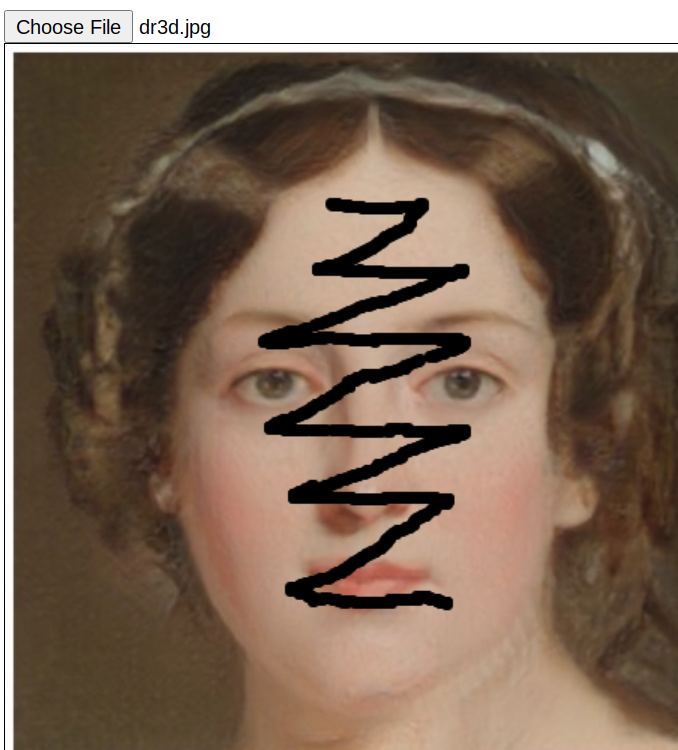

## Draw stroke on a canvas

One of the simple but important interactive examples is stroke editing.
Let's know about the mouse related events.

## Code and Results

Note that event parameter _e_ has many types of x,y coordinates depending on the origins.
For canvase cooridnates, we should use the coordinates prefixed with _layer_.


```javascript
const image_input = document.querySelector("#image-input");
const canvas = document.querySelector("#display-image") // canvas element
const ctx = canvas.getContext('2d')
var toggle = false
var radius = 4.0

canvas.addEventListener("mousemove", function(e) {
  xy = findxy(e)
  if (toggle) {
    ctx.beginPath();
    // arc(x, y, radius, startAngle, endAngle, counterclockwise)
    ctx.arc(xy[0], xy[1], radius, 0, Math.PI * 2, true);
    ctx.fill();
  }
}, false);
canvas.addEventListener("mousedown", function(e) {
  toggle = true
}, false);
canvas.addEventListener("mouseup", function(e) {
  toggle = false
}, false);
canvas.addEventListener("mouseout", function(e) {
  toggle = false
}, false);

function findxy(e) {
  // return [ e['clientX'], e['clientY'] ]
  return [ e['layerX'], e['layerY'] ]
}

```
 


## References

- [stack overflow](https://stackoverflow.com/questions/2368784/draw-on-html5-canvas-using-a-mouse) 
