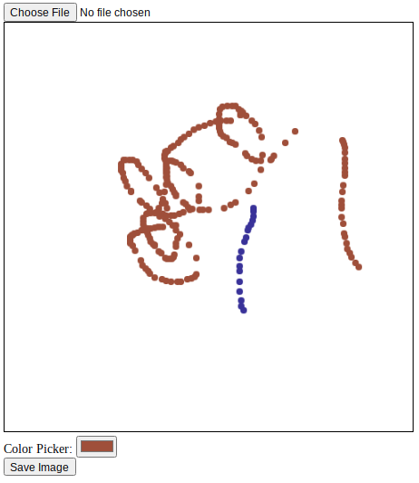

## Color Picker

In previous example, we can draw black stroke on the canvas.
However, it is better to choose the color we want to stroke with.
In this example, Let's implant color-picker UI element and change the color of stroke.


## Code and Results

```html
<label for="colorpicker">Color Picker:</label>
<input id="colorpicker" type="color" value="#0000ff">
```

```javascript
const colorpicker = document.getElementById("colorpicker")
var color = colorpicker.value
colorpicker.addEventListener("change", function(v) {
  color = this.value
})

canvas.addEventListener("mousemove", function(e) {
  xy = findxy(e)
  if (toggle) {
    ctx.beginPath();
    console.log(color)
    ctx.arc(xy[0], xy[1], radius, 0, Math.PI * 2, true);
    ctx.fillStyle = color // Define color
    ctx.fill();
  }
}, false);
```
 
## References

- [W3schools](https://www.w3schools.com/colors/colors_picker.asp) 
- [educative](https://www.educative.io/answers/how-to-add-a-color-picker-in-html) 
