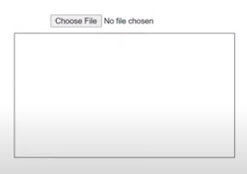
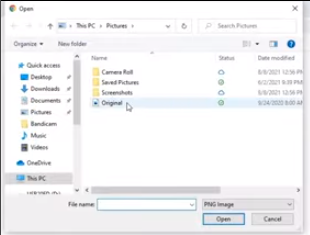
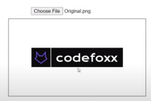

## How to Upload and Display Images with JavaScript

This is a simple example for uploading and displaying images with javascripts.
I heavily refered an good [blog post](https://medium.com/@codefoxx/how-to-upload-and-preview-an-image-with-javascript-749b92711b91).

### Example 

First of all, an display element, such as canvas, img, shows an empty page  
<br>
 
<br>
<br>
<br>

Using form with file type, we load an image from local system.
<br>
 
<br>
<br>
<br>

Finally, the image is drawn into the display element.
<br>

 
<br>

### Code Details

The code is really simple as belows.

``` javascript
const image_input = document.querySelector("#image-input");

image_input.addEventListener("change", function() {
  const reader = new FileReader();
  reader.addEventListener("load", () => {
    const uploaded_image = reader.result;
    document.querySelector("#display-image").style.backgroundImage = `url(${uploaded_image})`;
  });
  reader.readAsDataURL(this.files[0]);
});

```

The _document.querySelector()_ returns the first Element within the document that matches the specified selector, or group of selectors. If no matches are found, _null_ is returned. This has similar usage with _document.getElementById_. Let's first understand that the querySelector has more flexible usages.
